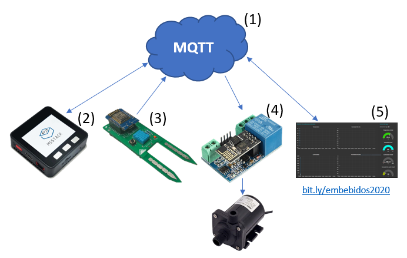

# Sistema de Monitorización para plantas
Sistema de monitorización para plantas como proyecto final para la asignatura de Sistemas Embebidos del MUISE UPV (Diciembre 2019)

Autores: 
* Alberto Díaz Paredes
* Jaime Laborda Macario

En este proyecto se ha desarrollado una aplicación IoT con la que se pueden monitorizar diferentes aspectos ambientales relativos a las plantas, además de poder actuar sobre su riego.

1. Plataforma IoT. Los dispositivos se comunican entre sí a través de un broker MQTT. Se crea un topic para cada sensor y actuador.

2. M5Stack. Se comunica con el broker MQTT a través de WiFi. A través de un sistema de menús, muestra valores actuales de los sensores, un histórico de estos datos a través de gráficos y permite actuar sobre la bomba de agua.

3. Sensor planta. Contiene sensores de temperatura, humedad ambiental y del suelo y de luz. Los datos son enviados al broker mediante WiFi empleando un ESP8266.

4. Actuador bomba. Un relé permite activar o desactivar la bomba de agua para el riego. Se conecta al broker MQTT a través de WiFi mediante un ESP8266.

5. Interfaz gráfica web. Utilizando Node-RED, muestra los valores actuales de los sensores, gráficos y permite actuar sobre la bomba.

